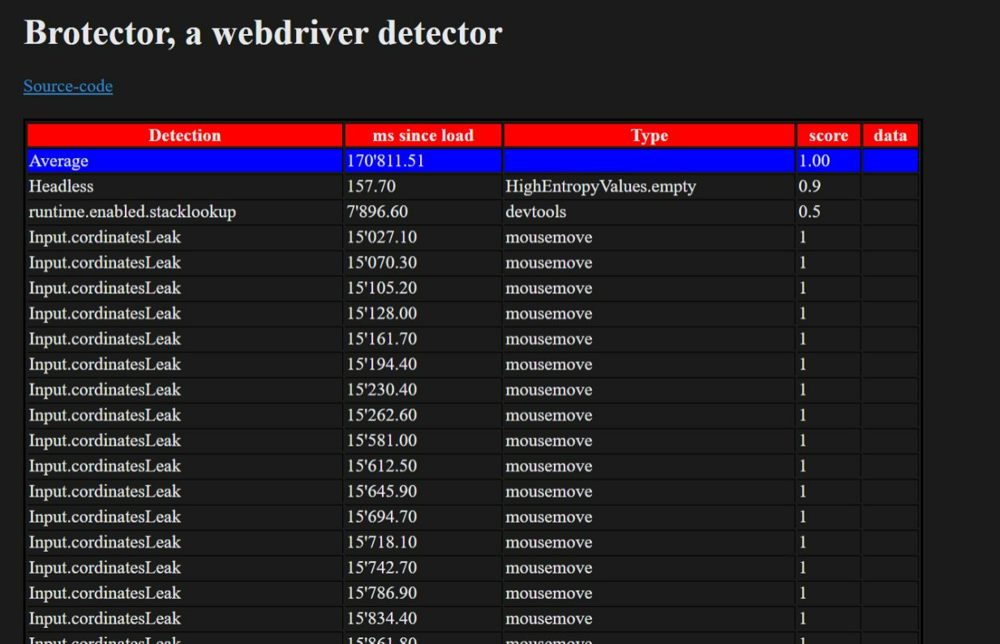
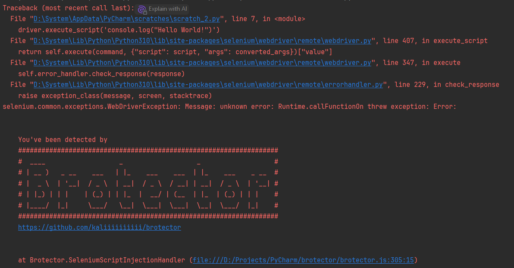

# Brotector

Detects or even **crashes** (❌) webdrivers such as:
- [x] [driverless](https://github.com/kaliiiiiiiiii/Selenium-Driverless)
  - [ ] **with [cdp-patches](https://github.com/Kaliiiiiiiiii-Vinyzu/CDP-Patches)**
- [x] [selenium](https://github.com/SeleniumHQ/selenium/tree/trunk/py#selenium-client-driver) ❌
  - [x] [undetected-chromedriver](https://github.com/ultrafunkamsterdam/undetected-chromedriver)
  - [x] [seleniumbase](https://github.com/seleniumbase/SeleniumBase)
- [x] [puppeteer](https://github.com/puppeteer/puppeteer) ❌
  - [ ] [puppeteer-extra-stealth](https://github.com/berstend/puppeteer-extra/tree/master/packages/puppeteer-extra-plugin-stealth#puppeteer-extra-plugin-stealth---)
  - [x] [pyppeteer](https://github.com/pyppeteer/pyppeteer)
    - [x] [pyppeteer-stealth](https://github.com/MeiK2333/pyppeteer_stealth)
- [x] [playwright](https://github.com/microsoft/playwright-python) ❌
  - [x] [undetected-playwright](https://github.com/kaliiiiiiiiii/undetected-playwright-python) (buggy)
    - [ ] with [cdp-patches](https://github.com/Kaliiiiiiiiii-Vinyzu/CDP-Patches) (no test yet)
  - [x] [botright](https://github.com/Vinyzu/Botright)
    - [x] with [uc-playwright](https://github.com/kaliiiiiiiiii/undetected-playwright-python) (buggy)
      - [ ] with [cdp-patches](https://github.com/Kaliiiiiiiiii-Vinyzu/CDP-Patches) (no test yet)
- [x] [nodriver](https://github.com/ultrafunkamsterdam/nodriver)
- [x] [@ulixee/hero](https://github.com/ulixee/hero)

For the tests, each webdriver has at least to click the button with the **ID** `clickHere`

## Detections

  
   

#### navigator.webdriver

`navigator.webdriver` (JavaScript) is set to `true`

-----
#### runtime.enabled

[`Runtime`](https://chromedevtools.github.io/devtools-protocol/tot/Runtime) is enabled \
score here refers to the certainty of the 
occurs when:
  - [`Runtime.enable`](https://chromedevtools.github.io/devtools-protocol/tot/Runtime/#method-enable) or [`Console.enable`](https://chromedevtools.github.io/devtools-protocol/tot/Console/#method-enable) (CDP) has been called (most libraries do that, type=webdriver)
  - the user opens the devtools (type=devtools)

-----
#### Input.cordinatesLeak
occurs due to [crbug#1477537](https://bugs.chromium.org/p/chromium/issues/detail?id=1477537) \
[CDP-Patches](https://github.com/Kaliiiiiiiiii-Vinyzu/CDP-Patches) can be used to bypass this

-----
#### window.cdc
a leak specific to **chromedriver** (selenium) \
see [stackoverflow-answer](https://stackoverflow.com/a/75776883/20443541)

----
#### "Input.untrusted"
Mouse event not dispatched by a user detected
see [`Event.isTrusted`](https://developer.mozilla.org/en-US/docs/Web/API/Event/isTrusted) property

----
#### canvasMouseVisualizer
`CanvasRenderingContext2D.arc` has been called with
- cordinates +-5px at current mouse position
- canvas +-1px covers the whole page
- canvas passes pointerEvents through

----
#### UAOverride
[`navigator.userAgentData.getHighEntropyValues`](https://developer.mozilla.org/en-US/docs/Web/API/NavigatorUAData/getHighEntropyValues) has empty data \
  (type=`HighEntropyValues.empty`, UA meaning UserAgent)

----
#### SeleniumScriptInjection
- Detects when selenium tries to [inject a script](https://github.com/kaliiiiiiiiii/brotector/issues/6) (even used for finding elements)
- makes selenium (any chromedriver-based framework) crash (bypassable for testing [`?crash=false`](https://kaliiiiiiiiii.github.io/brotector/?crash=false))
- just **don't use selenium** lol

----
#### PWinitScript
- detects `playwright>=1.46.1`, induced with [commit](https://github.com/microsoft/playwright/commit/c9e673c6dca746384338ab6bb0cf63c7e7caa9b2#diff-087773eea292da9db5a3f27de8f1a2940cdb895383ad750c3cd8e01772a35b40R909-R924)

----
#### stack.signature
detects injected javascript based on the stack trace in hooks

----
#### pdfStyle
a detection regarding PDF rendering,
specific to puppeteer [github issue](https://github.com/kaliiiiiiiiii/brotector/issues/5) or `--enable-field-trial-config` \
Note: There might be false-positives

----
#### popupCrash
crashes chrome when automated with playwright or puppeteer due to [crbug#340836884](https://issues.chromium.org/issues/340836884)
(bypassable for testing [`?crash=false`](https://kaliiiiiiiiii.github.io/brotector/?crash=false))

## Contribution
feel free to
- open `[feature request]`s for driver detections
- open PRs
- use the discussions

## Licence
see [LICENSE](https://github.com/kaliiiiiiiiii/brotector/blob/master/LICENSE)

## Author & Copyright

Aurin Aegerter (aka Steve, kaliiiiiiiiii)

## Thanks // References
- [selenium-detector](https://github.com/HMaker/HMaker.github.io/tree/master/selenium-detector)
- [jdetects](https://github.com/zswang/jdetects)
- thanks @ProseccoRider - some further `Runtime.enable` detection insights
